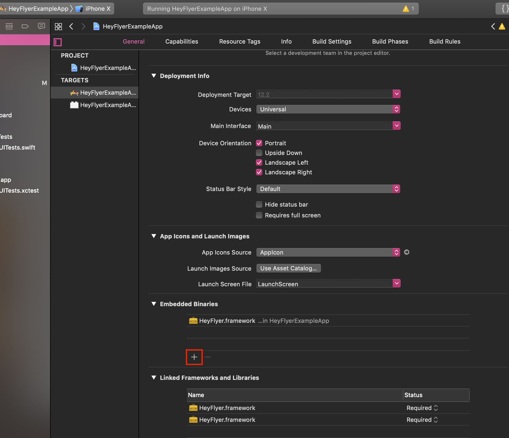

# HeyFlyer

[](https://travis-ci.org/icanpunit/HeyFlyerAirportData)
[](https://cocoapods.org/pods/HeyFlyerAirportData)
[](https://cocoapods.org/pods/HeyFlyerAirportData)
[](https://cocoapods.org/pods/HeyFlyerAirportData)

## Usage

To run the example project, clone the repo, and run  first.

## Initialization

First of all you have to generate API key to use HeyFlyer in the <a href="https://www.heyflyer.com/e/">console</a>.
And then use the following code:
```swift
setHeyFlyerServerKey.init(setKey: "API_KEY_HERE")
```

## Using

The framework supports 2 endpoinds: <i>AirpotCode</i>, <i>apiUserId</i>. You can find more information in the official source. How to use from the framework.

##### Create Instance Of HeyFlyer
```swift
import HeyFlyer
...

var getairportData  = HttpHeyFlyerWrapper()
```

##### add HttpHeyflyerDelegate Method 

```swift
class ViewController: UIViewController,HttpHeyflyerDelegate {
```

##### Set Delegate For your instance 

```swift
self.getairportData = HttpHeyFlyerWrapper.init()
self.getairportData.delegate = self
```


##### Retrieving Flight Data Using Delegate Methods

```swift
    //HeyFlyer Wrapper Success Delegate Method
    func HttpHeyflyerfetchDataSuccess(wrapper: HttpHeyFlyerWrapper, dicsResponse: NSMutableDictionary) {
        print(dicsResponse)
    }
    //HeyFlyer Wrapper Fail Delegate Method
    func HttpHeyflyerfetchDataFail(wrapper: HttpHeyFlyerWrapper, error: NSError) {
        print(error)
    }
```
## Usage

### Quick Start

```swift
import HeyFlyer

class ViewController: UIViewController,HttpHeyflyerDelegate {
    
    //HeyFlyer Wrapper Success Delegate Method
    func HttpHeyflyerfetchDataSuccess(wrapper: HttpHeyFlyerWrapper, dicsResponse: NSMutableDictionary) {
        print(dicsResponse)
    }
    //HeyFlyer Wrapper Fail Delegate Method
    func HttpHeyflyerfetchDataFail(wrapper: HttpHeyFlyerWrapper, error: NSError) {
        print(error)
    }
    
    
    var getairportData  = HttpHeyFlyerWrapper()
    
    override func viewDidLoad() {
        super.viewDidLoad()
        GetAirportData()
       
        // Do any additional setup after loading the view.
    }
    
    
    //Airport Data JSON Get In Delegate Method
    func GetAirportData()
    {
        //Check Net Connection First
        self.getairportData = HttpHeyFlyerWrapper.init()
        self.getairportData.delegate = self
        self.getairportData.AirportData(AirpotCode: "DXB", apiUserId: "1")
        
    }
}
```
##### Set Embedded Binaries

The next step is linking your framework to the newly created app. Before linking it, it is convenient to drag the .framework file into the project folder of the new app. Now, select the app target and select the ‘general’ tab in the app settings. Scroll to ‘Embedded Binaries’ and press the ‘plus’ icon to embed a new binary.




## Author

icanpunit, ican.punit@gmail.com

## License

HeyFlyerAirportData is available under the MIT license. See the LICENSE file for more info.
